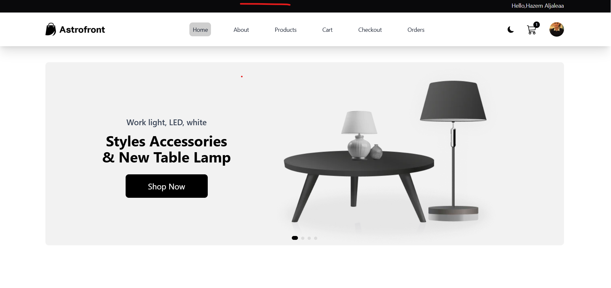
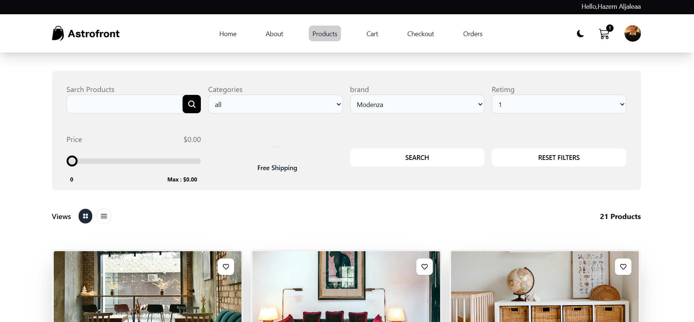

# 🛒 E-Commerce App

A modern, full-stack E-Commerce application built with **React.js** frontend (Vite) and **Laravel PHP** backend.



## ⚡️ Features
Admin Dashboard
🧑‍💼 User management & analytics
📦 Product management & analytics
🗂️ Category management & analytics
📈 Order statistics & analytics
✉️ Messages/communications
🎨 App layout customization
### 🧑‍💻 Frontend (React)

- ⚡️ Vite for fast builds
- 🧭 React Router 6.4+ with loaders/actions
- 📦 Redux Toolkit (RTK) for global state
- 🔁 React Query for async caching & data fetching
- 🧪 Axios for HTTP requests
- 🧩 Shadcn UI + Tailwind CSS for clean UI
- 🔐 Auth, Cart, Checkout, Product Filters, etc.

### 🔧 Backend (Laravel)

- 🧬 RESTful API built in Laravel 10+
- 🔐 JWT Auth or Sanctum
- 🗃️ MySQL or PostgreSQL DB
- 🛍️ Endpoints for products, cart, auth, orders

---

## 📁 Project Structure

```
frontend/
├── src/
│   ├── components/
│   ├── features/     # RTK slices & logic
│   ├── pages/        # React Router routes
│   ├── services/     # Axios + React Query
│   ├── ui/           # Shadcn UI components
│   └── main.tsx
│
└── tailwind.config.js
```

```
backend/
├── app/
│   ├── Http/Controllers/
│   ├── Models/
├── routes/api.php
└── .env
```

---

## 🚀 Getting Started

### 🖥️ Frontend (React + Vite)

```bash
cd frontend
npm install
npm run dev
```

> Update the `.env` file with your backend API base URL:

```
VITE_API_URL=http://localhost:8000/api
```

---

### 🛠 Backend (Laravel)

```bash
cd backend
composer install
cp .env.example .env
php artisan key:generate

php artisan migrate --seed
php artisan serve
```

> Add CORS config in Laravel (`config/cors.php`) to allow frontend origin.

---

## 🧪 Tech Stack

| Layer      | Tool                        |
| ---------- | --------------------------- |
| Frontend   | React.js + Vite             |
| Routing    | React Router 6.4+           |
| State      | Redux Toolkit + React Query |
| Styling    | Tailwind CSS + Shadcn UI    |
| API Client | Axios                       |
| Backend    | Laravel PHP (REST API)      |
| Auth       | Laravel Sanctum / JWT       |
| DB         | MySQL / PostgreSQL          |

---

## ✅ Features Implemented

- [x] Product listing with filters & categories
- [x] Product details page
- [x] Shopping cart (add/remove/update)
- [x] Auth (login/register/logout)
- [x] Checkout & order summary
- [x] Admin product management (WIP)
- [x] Responsive & accessible UI

---

## 🛠 API Endpoints

| Method | Endpoint             | Description       |
| ------ | -------------------- | ----------------- |
| GET    | `/api/products`      | List products     |
| GET    | `/api/products/{id}` | Product detail    |
| POST   | `/api/cart`          | Add to cart       |
| POST   | `/api/login`         | User login        |
| POST   | `/api/register`      | User registration |
| GET    | `/api/orders`        | List user orders  |

---

## 📸 Screenshots

> Add screenshots here if available (UI, cart, product pages, etc.)

---

## 🙏 Acknowledgments

- [Vite](https://vitejs.dev/)
- [Tailwind CSS](https://tailwindcss.com/)
- [Laravel](https://laravel.com/)
- [React Router](https://reactrouter.com/en/main)
- [Redux Toolkit](https://redux-toolkit.js.org/)
- [Shadcn UI](https://ui.shadcn.dev/)

---

## 📄 License

This project is open-source under the [MIT License](LICENSE).

---

## 💬 Want Help?

Feel free to open an issue or contact the maintainer.
